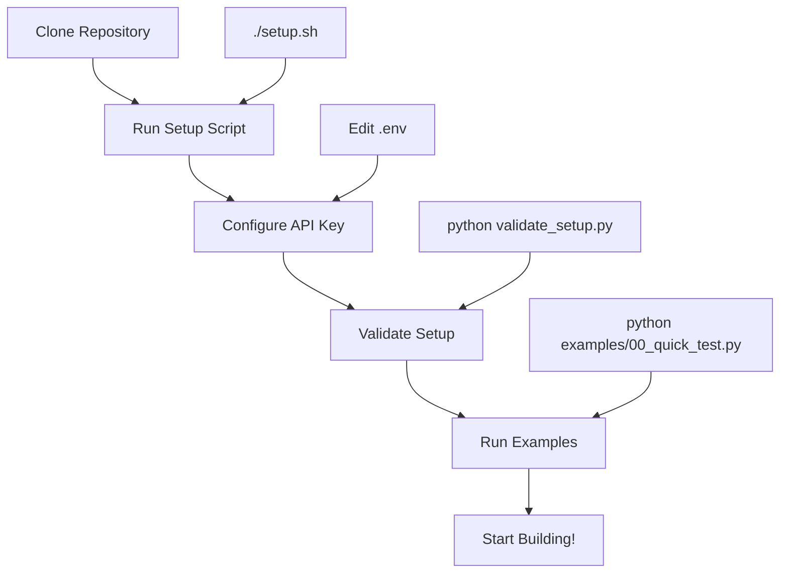

# LangExtract Test Setup 🚀

A complete, tested setup for Google's LangExtract library with working examples, automated setup scripts, and comprehensive documentation.

[](https://www.python.org/downloads/)
[](https://aistudio.google.com/app/apikey)
[](https://github.com/google/langextract)

## 🎯 What This Repository Provides

- **🔧 Automated Setup**: One-command installation script that handles all dependencies
- **✅ Validation Tools**: Scripts to verify your setup before you start coding
- **📚 Working Examples**: Ready-to-run examples for common use cases
- **🎨 Visualizations**: Interactive HTML output for extracted data
- **📖 Complete Documentation**: Troubleshooting guides and best practices

## 🚦 Setup Flow



## 🚀 Quick Start (Recommended)

### Prerequisites
- **miniconda** or **conda** ([Download here](https://docs.conda.io/en/latest/miniconda.html))
- **Gemini API Key** ([Get one here](https://aistudio.google.com/app/apikey))

### 1-Command Setup

```bash
# Clone and run automated setup
git clone https://github.com/Project-Kobo/lang-extract-test.git
cd lang-extract-test
./setup.sh
```

The setup script will:
- ✅ Find your conda installation
- ✅ Create Python 3.11 environment  
- ✅ Clone and install LangExtract
- ✅ Verify all dependencies
- ✅ Create output directories

### Configure API Key

```bash
# Copy template and add your API key
cp .env.example .env
# Edit .env and replace 'your-api-key-here' with your actual Gemini API key
```

### Validate & Test

```bash
# Activate environment
conda activate langextract

# Run comprehensive validation
python validate_setup.py

# Quick functionality test
python examples/00_quick_test.py
```

## 🎛️ Manual Setup (Alternative)

<details>
<summary>Click here for step-by-step manual installation</summary>

### 1. Environment Setup
```bash
# Create conda environment
conda create -n langextract python=3.11 -y
conda activate langextract

# Clone LangExtract
git clone https://github.com/google/langextract.git
cd langextract
pip install -e ".[dev]"
cd ..
```

### 2. API Configuration
```bash
echo "LANGEXTRACT_API_KEY=your-actual-api-key" > .env
```

### 3. Install Additional Dependencies
```bash
pip install -r requirements.txt
```

</details>

## 🧪 Examples & Usage

### Quick Test
```bash
python examples/00_quick_test.py
```
*Minimal test to verify setup works*

### Character & Emotion Extraction
```bash
python examples/basic_example.py
```
*Extract characters and emotions from Romeo & Juliet text*

### Medical Information Extraction  
```bash
python examples/medical_example.py
```
*Extract medications, dosages, and administration routes*

### Interactive Visualizations
```bash
python examples/visualization_example.py
```
*Generate HTML visualizations of extracted data*

### URL-based Extraction
```bash
python examples/url_example.py
```
*Extract from web content (Project Gutenberg)*

## 📊 Example Output

### Medical Extraction Results
```json
{
  "extractions": [
    {
      "extraction_class": "medication",
      "extraction_text": "Aspirin",
      "attributes": {"drug_class": "antiplatelet", "generic_name": "aspirin"}
    },
    {
      "extraction_class": "dosage", 
      "extraction_text": "81mg",
      "attributes": {"amount": "81", "unit": "mg"}
    }
  ]
}
```

### Visual Output
The examples generate interactive HTML visualizations showing:
- 🎯 Highlighted extracted entities in context
- 📋 Structured data tables
- 🔗 Relationships between entities
- 📈 Extraction statistics

## 🗂️ Repository Structure

```
lang-extract-test/
├── 🔧 setup.sh                     # Automated setup script
├── ✅ validate_setup.py             # Setup validation
├── 📋 requirements.txt              # Pinned dependencies
├── 🔐 .env.example                 # API key template
├── 📁 examples/
│   ├── 00_quick_test.py            # Minimal validation test
│   ├── basic_example.py            # Character extraction  
│   ├── medical_example.py          # Medical data extraction
│   ├── visualization_example.py    # HTML generation
│   └── url_example.py              # Web content extraction
├── 📁 outputs/                     # Generated files (git-ignored)
│   ├── basic/                      # Basic example outputs
│   ├── medical/                    # Medical extraction outputs
│   ├── visualization/              # HTML visualizations
│   └── url/                        # URL extraction outputs
├── 📁 docs/
│   ├── setup_notes.md              # Detailed setup guide
│   └── troubleshooting.md          # Common issues & solutions
└── 📁 langextract/                 # Original repo (auto-cloned)
```

## 🛠️ Features Demonstrated

| Feature | Example | Output |
|---------|---------|--------|
| **Character Extraction** | Romeo & Juliet analysis | Characters with emotional states |
| **Medical NLP** | Medication parsing | Drugs, dosages, frequencies |
| **Relationship Mapping** | Entity connections | Structured relationship data |
| **Visualization** | Interactive HTML | Highlighted text + data tables |
| **URL Processing** | Web content extraction | Large document analysis |
| **Multi-format Output** | JSONL, HTML, CSV | Various export formats |

## 🔧 Validation & Diagnostics

### Comprehensive Setup Check
```bash
python validate_setup.py
```
**Validates:**
- ✅ Python version compatibility
- ✅ Conda environment setup
- ✅ LangExtract installation
- ✅ Critical dependencies
- ✅ API key configuration
- ✅ API connectivity
- ✅ Output directory structure

### Quick Functionality Test
```bash
python examples/00_quick_test.py
```
**Tests:**
- 🔍 Import functionality
- 🔧 Environment variables  
- 🚀 Basic extraction
- 📁 File operations

## ⚡ Performance & Optimization

### Recommended Settings

| Use Case | Model | Workers | Buffer Size | Passes |
|----------|-------|---------|-------------|---------|
| **Development** | `gemini-2.5-flash` | 2 | 2000 | 1 |
| **Production** | `gemini-2.5-flash` | 10 | 1500 | 2 |
| **High Accuracy** | `gemini-2.5-pro` | 5 | 1000 | 3 |
| **Large Documents** | `gemini-2.5-flash` | 20 | 1000 | 3 |

### Cost Optimization
```python
# For development - minimal cost
result = lx.extract(
    text_or_documents=input_text[:1000],  # Limit text size
    model_id="gemini-2.5-flash",         # Fastest/cheapest
    max_workers=2,                       # Reduce concurrency
    extraction_passes=1                  # Single pass
)
```

## 🚨 Troubleshooting

### Common Issues

| Problem | Solution |
|---------|----------|
| `conda: command not found` | Run `./setup.sh` or see [troubleshooting.md](docs/troubleshooting.md) |
| `API key not valid` | Check `.env` file and verify key at [AI Studio](https://aistudio.google.com/app/apikey) |
| `ModuleNotFoundError` | Run `conda activate langextract` |
| `Rate limit exceeded` | Reduce `max_workers` or add delays |
| Empty extractions | Improve prompt clarity and examples |

### Advanced Diagnostics
```bash
# Detailed environment check
python validate_setup.py

# Test with debug logging
python -c "
import logging
logging.basicConfig(level=logging.DEBUG)
# your code here
"

# Check package versions
conda list | grep -E "(python|langextract|google)"
```

## 🔄 Updates & Maintenance

### Updating LangExtract
```bash
cd langextract
git pull origin main
pip install -e ".[dev]"
```

### Cleaning Outputs
```bash
# Remove all generated files
find outputs/ -type f -not -name "README.md" -delete

# Or remove specific category
rm -rf outputs/medical/*
```

## 🤝 Contributing & Development

### Development Workflow
```bash
# Install development tools
pip install -e ".[dev]"

# Run linting
pylint examples/
pyink --check examples/

# Run type checking  
pytype examples/
```

### Adding New Examples
1. Create new example in `examples/`
2. Add output directory in `outputs/`
3. Update this README
4. Test with `validate_setup.py`

## 📚 Resources & Links

- 📖 [LangExtract Official Documentation](https://github.com/google/langextract)
- 🔑 [Gemini API Keys](https://aistudio.google.com/app/apikey)
- 📘 [Gemini API Documentation](https://ai.google.dev/gemini-api/docs)
- 🐍 [Miniconda Download](https://docs.conda.io/en/latest/miniconda.html)
- 🔧 [Detailed Setup Notes](docs/setup_notes.md)
- 🚨 [Troubleshooting Guide](docs/troubleshooting.md)

## 📋 Requirements

- **Python**: 3.11+ 
- **Memory**: 4GB+ RAM recommended
- **Storage**: 2GB+ free space
- **Network**: Internet connection for API calls
- **OS**: macOS, Linux, or Windows with WSL

## 📄 License

This setup repository is provided for demonstration purposes. LangExtract itself is licensed under the Apache 2.0 License by Google LLC.

---

**🎯 Ready to start?** Run `./setup.sh` and then `python validate_setup.py`

**❓ Need help?** Check the [troubleshooting guide](docs/troubleshooting.md) or [open an issue](https://github.com/Project-Kobo/lang-extract-test/issues)